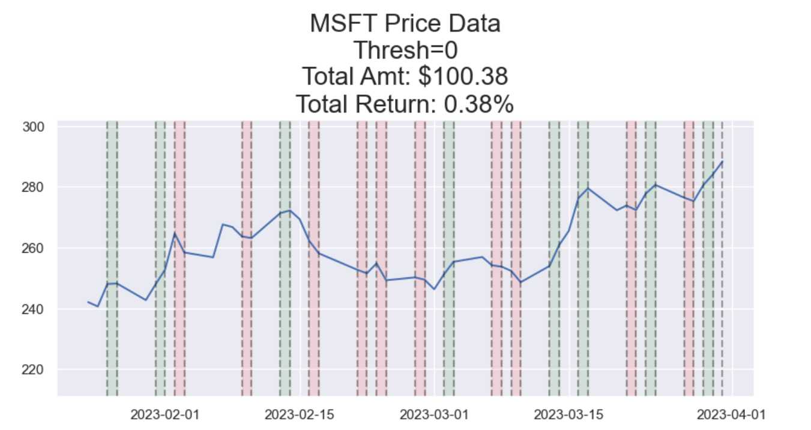
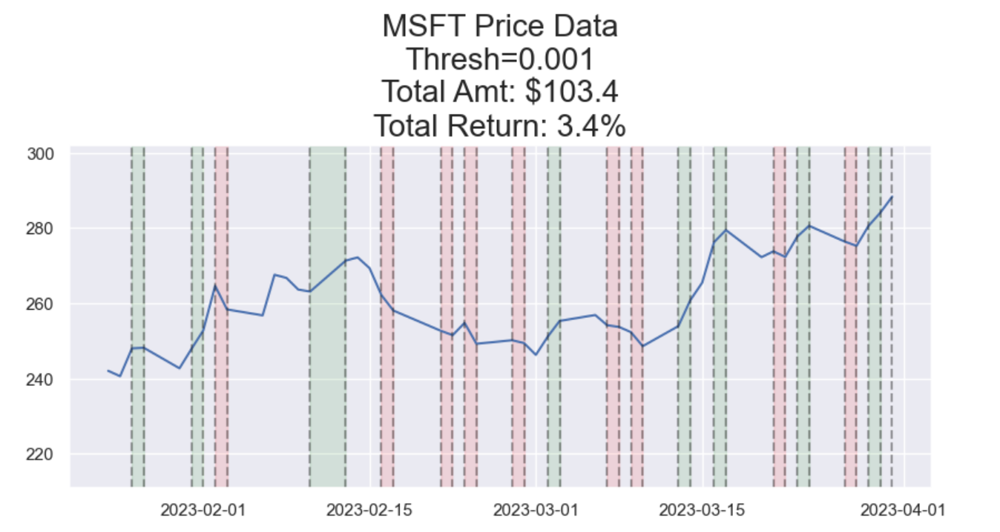
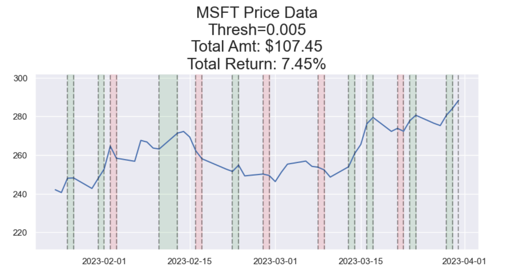

# Stock Prediction and Trading Strategy

## Overview

This repository contains the code and documentation for a stock prediction and trading strategy project. The project aims to predict stock prices using an ARIMA model and implement a trading strategy based on the model's predictions.

## Table of Contents

- [Installation](#installation)
- [Usage](#usage)
- [Project Structure](#project-structure)
- [Dependencies](#dependencies)
- [Data](#data)
- [Methodology](#methodology)
- [Results](#results)
- [How to Contribute](#how-to-contribute)

## Installation

1. Clone the repository:

`git clone https://github.com/your-username/stock-prediction-trading.git`

2. Install the required dependencies:

`pip install -r requirements.txt`

## Usage

- Open the Jupyter Notebook file Stock_Prediction_Trading.ipynb in a Jupyter environment.
- Run the cells to execute the code and generate predictions.
- Explore the simulation results and visualize trading performance.

## Project Structure

- Jupyter Notebook containing the code for stock prediction and trading simulation.
- Requirements file

## Dependencies

- Python
- Jupyter Notebook
- pandas
- yfinance
- matplotlib
- seaborn
- statsmodels
- tqdm

# Install the dependencies using the provided requirements.txt file:

`pip install -r requirements.txt`

## Data

The historical stock price data for Microsoft (MSFT) is downloaded using the yfinance library.

## Methodology

1. **Data Collection:**
   - Historical stock price data for MSFT is downloaded using the yfinance library.
2. **Data Preprocessing:**
   - Data is cleaned and explored to handle null values.
3. **Stationarity Check:**
   - The Augmented Dickey-Fuller and KPSS tests are performed to check stationarity.
   - Differencing is applied to make the data stationary.
4. **ARIMA Modeling:**
   - A suitable ARIMA model is chosen based on ACF and PACF plots.
   - The model is trained on the differenced data.
5. **Trading Strategy Simulation:**
   - A simulation is run using the ARIMA model to make buy/sell decisions based on specified thresholds.
   - Simulation results, including returns, are recorded.

## Results

### Simulation Results:
1. **Threshold = 0:**
   - Initial Amount: $100
   - Positive Return: 0.38%
   - Total Return Amount: $100.38

  

2. **Threshold = 0.001:**
   - Initial Amount: $100
   - Positive Return: 3.4%
   - Total Return Amount: $103.4
  
  

3. **Threshold = 0.005:**
   - Initial Amount: $100
   - Positive Return: 7.45%
   - Total Return Amount: $107.45
   
  

## How to Contribute

- If you'd like to contribute to this project, please follow these steps:
- Fork the repository.
- Create a new branch for your feature: `git checkout -b feature-name`
- Commit your changes: `git commit -m 'Add new feature'`
- Push to the branch: `git push origin feature-name`
- Submit a pull request.
